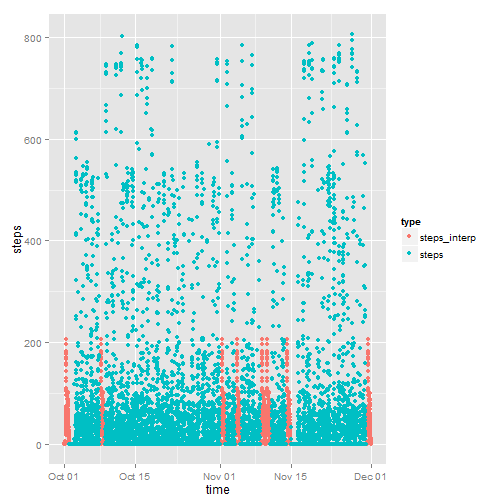

## Load necessary packages to execute

```r
library(reshape2)
library(ggplot2)
library(scales)
library(zoo)
```

## Load and preprocessing the data
The input data file is stored in the ./data subdirectory and
is in a comma-separated variable format (.csv extension).
The first row contains the header names {steps, date, interval}.

```r
inFile <- './data/activity.csv'
df_activity <- read.csv(inFile)
head(df_activity)
```

```
##   steps       date interval
## 1    NA 2012-10-01        0
## 2    NA 2012-10-01        5
## 3    NA 2012-10-01       10
## 4    NA 2012-10-01       15
## 5    NA 2012-10-01       20
## 6    NA 2012-10-01       25
```
A time field is computed from the "date" and "interval".  
"steps" that are NA are identified.

```r
# Calculate POSIX time from date and interval fields
df_activity$time <- as.POSIXct(3600*floor(df_activity$interval/100)
                               + 60*(df_activity$interval %% 100), 
                               tz = "GMT", 
                               origin = as.POSIXct(df_activity$date, tz = "GMT"))
# Mark all NA fields
df_activity$na_steps <- is.na(df_activity$steps)
# Minutes within the day
df_activity$minutes <- 60*floor(df_activity$interval/100) +
                       (df_activity$interval %% 100)
# Number of days within the record
NUM_DAYS <- length(unique(df_activity$date))
# Number of time intervals within a day
NUM_INTERVALS_PER_DAY <- length(unique(df_activity$interval))
head(df_activity)
```

```
##   steps       date interval                time na_steps minutes
## 1    NA 2012-10-01        0 2012-10-01 00:00:00     TRUE       0
## 2    NA 2012-10-01        5 2012-10-01 00:05:00     TRUE       5
## 3    NA 2012-10-01       10 2012-10-01 00:10:00     TRUE      10
## 4    NA 2012-10-01       15 2012-10-01 00:15:00     TRUE      15
## 5    NA 2012-10-01       20 2012-10-01 00:20:00     TRUE      20
## 6    NA 2012-10-01       25 2012-10-01 00:25:00     TRUE      25
```


## Find the total number of steps taken per day

```r
# Calculate the total # steps for each day
daily_steps <- aggregate(steps ~ date, FUN = sum, data = df_activity)
head(daily_steps)
```

```
##         date steps
## 1 2012-10-02   126
## 2 2012-10-03 11352
## 3 2012-10-04 12116
## 4 2012-10-05 13294
## 5 2012-10-06 15420
## 6 2012-10-07 11015
```

```r
# Histogram plot
p <- qplot(steps, data = daily_steps, geom = "histogram", binwidth = 1000)
p <- p + xlab("Daily Steps")                    # x-axis label
p <- p + ylab("Count")                          # y-axis label
p <- p + ggtitle("Histogram of Daily Steps")    # graph title
print(p)
```

 


```r
# Calculate the mean and median of the original data
mean_daily_steps <- sprintf("%.1f", mean(daily_steps[,2]))
median_daily_steps <- sprintf("%d", median(daily_steps[,2]))
```
The mean steps per day is 10766.2.  
The median steps per day is 10765.

## Display the average daily activity pattern
Create a new data frame holding the 5-minute time interval and the sum of all steps from all days at that specific time interval. The first few lines of this data frame are output below.

```r
time_steps <- aggregate(steps ~ minutes, FUN = sum, data = df_activity)
head(time_steps)
```

```
##   minutes steps
## 1       0    91
## 2       5    18
## 3      10     7
## 4      15     8
## 5      20     4
## 6      25   111
```

Plot the average daily activity pattern. For each 5-minute interval, the steps over all days are averaged. The result for all 5-minute intervals in a day are plotted below. The maximum point is indicated in the plot.

```r
# Find the maximum step time and value
i_max <- which.max(time_steps[,2])
t_max <- sprintf("%2d:%02d", 
                 floor(time_steps[i_max,1] / 60),
                 time_steps[i_max,1] %% 60)
s_max <- time_steps[i_max,2] / NUM_DAYS

# Plot the averages over time
p <- ggplot(time_steps, aes(x=minutes, y=steps/NUM_DAYS))
# Line graph
p <- p + geom_line(size=1)
# Red point for the maximum step time and value
p <- p + annotate("point", x=time_steps$minutes[i_max], 
                           y=s_max, 
                           colour="red")
# Text indicating the maximum step time and value
p <- p + annotate("text", 
                  x=time_steps$minutes[i_max], 
                  y=s_max, 
                  hjust=0,
                  label=sprintf("  (%s, %.1f)", t_max, s_max),
                  colour = "red")
# Pretty up the x-axis
# Calculate 5 even breaks on x-axis
t_breaks <- seq(from=1, to=NUM_INTERVALS_PER_DAY, length.out=5);
# Add the breaks and labels (that don't have the day information)
p <- p + scale_x_continuous(breaks = time_steps$minutes[t_breaks],
                            labels = c("00:00","06:00","12:00","18:00","24:00"))
p <- p + xlab("Time of Day")                    # x-axis label
p <- p + ylab("Steps")                          # y-axis label
p <- p + ggtitle("Mean Steps by Time of Day")   # graph title
print(p)
```

 
  
The maximum average daily steps is 179.1311, occured at time  8:35 and is drawn in red.


## Imputing missing values
Missing (NA) values with non-missing adjacent step values are linearly interpolated in
time to impute their new value.

```r
# Count of NA in original step data
num_na <- sum(df_activity$na_steps)
# Use the zoo package to calculate interpolated NA values
# Start with the original step data
df_activity$steps_interp <- df_activity$steps
# Fill in NA (imputed values)
# Interpolate steps using the time of day (interval) value
zz <- round(na.approx(df_activity$steps_interp, df_activity$interval, na.rm = FALSE))
# Replace only the remaining NA values
df_activity$steps_interp[is.na(df_activity$steps_interp)] <- zz[is.na(df_activity$steps_interp)]

# Calculate the total # steps (imputed) for each day
daily_steps_interp <- aggregate(steps_interp ~ date, FUN = sum, data = df_activity)
head(daily_steps_interp)
```

```
##         date steps_interp
## 1 2012-10-01        10762
## 2 2012-10-02          126
## 3 2012-10-03        11352
## 4 2012-10-04        12116
## 5 2012-10-05        13294
## 6 2012-10-06        15420
```

Plot a histogram showing the distribution of the total number of steps per day

```r
# Histogram plot
p <- qplot(steps_interp, data = daily_steps_interp, geom = "histogram", binwidth = 1000)
p <- p + xlab("Daily Steps")                    # x-axis label
p <- p + ylab("Count")                          # y-axis label
p <- p + ggtitle(expression(atop("Histogram of Daily Steps",
                                 "NA's Interpolated")))     # graph title
print(p)
```

 


```r
# Calculate the mean and median of the imputed data
mean_daily_steps_interp <- sprintf("%.1f", mean(daily_steps_interp[,2]))
median_daily_steps_interp <- sprintf("%d", median(daily_steps_interp[,2]))
```
  
In the original data set, there are 2304 missing step values (indicated with NA).
After imputing the missing (NA) values, the mean steps per day is 
10765.6 versus 10766.2 (raw data).  
After imputing the missing (NA) values, the median steps per day is 
10762 versus 10765 (raw data).  

The following graph shows the original data steps and the newly imputed steps.

```r
m <- melt(df_activity, 
          id.vars = "time", 
          measure.vars = c("steps_interp","steps"),
          variable.name = "type",
          value.name = "steps")
ggplot() + geom_point(data=m, aes(x=time, y=steps, group=type, colour=type))
```

```
## Warning: Removed 2304 rows containing missing values (geom_point).
```

 

## Show the differences in activity patterns between weekdays and weekends
A new field is added to identify the weekend/weekday entries. Then the df_activity 
data.frame is minimized and the mean step values computed for {weekday, weekend} 
and {minutes} into steps_by_day_interval. The head of the changed data frames are
output.

```r
# Identify the weekdays and weekends
df_activity$weekday <- factor(weekdays(df_activity$time) %in% c('Saturday','Sunday'),
                              levels=c("TRUE", "FALSE"), 
                              labels=c("Weekend","Weekday"))
head(df_activity)
```

```
##   steps       date interval                time na_steps minutes
## 1    NA 2012-10-01        0 2012-10-01 00:00:00     TRUE       0
## 2    NA 2012-10-01        5 2012-10-01 00:05:00     TRUE       5
## 3    NA 2012-10-01       10 2012-10-01 00:10:00     TRUE      10
## 4    NA 2012-10-01       15 2012-10-01 00:15:00     TRUE      15
## 5    NA 2012-10-01       20 2012-10-01 00:20:00     TRUE      20
## 6    NA 2012-10-01       25 2012-10-01 00:25:00     TRUE      25
##   steps_interp weekday
## 1            2 Weekday
## 2            0 Weekday
## 3            0 Weekday
## 4            0 Weekday
## 5            0 Weekday
## 6            2 Weekday
```

```r
# Calculate the mean # steps for each weekday/interval pair
steps_by_day_interval <- aggregate(steps ~ minutes + weekday, FUN = mean, data = df_activity)
head(steps_by_day_interval)
```

```
##   minutes weekday steps
## 1       0 Weekend 0.000
## 2       5 Weekend 0.000
## 3      10 Weekend 0.000
## 4      15 Weekend 0.000
## 5      20 Weekend 0.000
## 6      25 Weekend 3.714
```

```r
# Calculate the interval values for each 6-hour period
t_breaks <- seq(1, max(df_activity$minutes)+5, length.out=5)
```


Two plots to compare the average steps for each 5-minute interval on weekends and weekdays.

```r
# Plot the weekend & weekday mean steps throughout the day
p <- ggplot(steps_by_day_interval, aes(minutes, steps))
p <- p + geom_line()                            # line plot
p <- p + facet_grid(weekday ~ .)                # Top/Bottom plot
p <- p + scale_x_continuous(breaks = df_activity$minutes[t_breaks],
                            labels = c("00:00","06:00","12:00","18:00","24:00"))
p <- p + xlab("Time of Day")                    # x-axis label
p <- p + ylab("Steps")                          # y-axis label
p <- p + ggtitle("Mean Steps by Time of Day")   # graph title
print(p)
```

 
